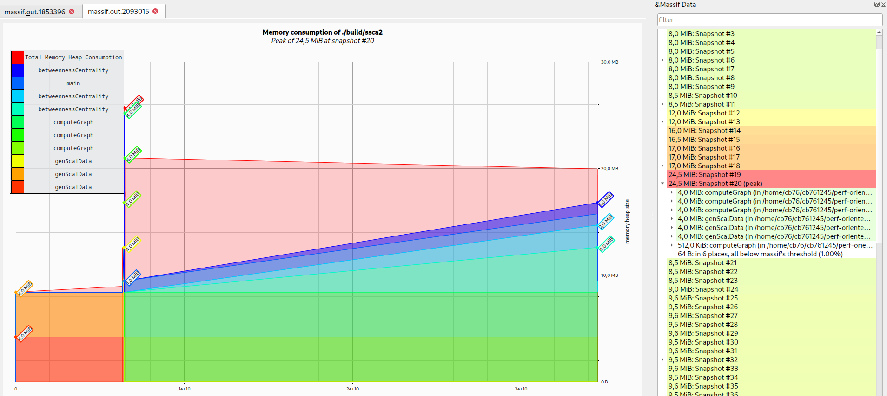
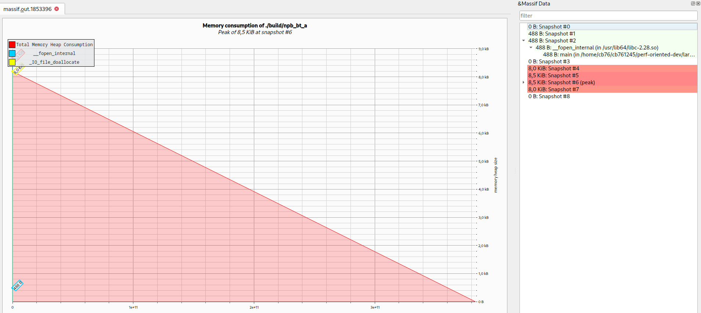

# Exercise Sheet 4


> **for all builds:**   
> buildtype = release  
> profiled on lcc3  
> **for ssca2:**  scale = 17  
> **for nbt_bt:** problemsize = a
> 

## Exercise 1 - Valgrind Massif

***Using valgrind massif:***
```sh
valgrind --tool=massif ./program
```
the resulting output file (massif.out.xxxxx) can then be opened with massif visualizer

### SSCA2




### Conclusion
The peak memory allocation of 24.5 MiB was at snapshot 20.
Looking at the graph, one can see the spike easily. The majority of the allocations are from the computeGraph and the genScalData functions, with 12 MiB each. It looks like most of this is released soon after tho. From this point on, computeGraph stays on 8 MiB allocated, while betweennessCentrality steadily keeps allocating more memory until the end of the program. The last snapshot lists 0B allocated, which hints that all allocated memory got freed correctly.

### NPB_BT_A



### Conclusion
NPB_BT_A allocates around 8B of heap at the beginning of the execution and succeedingly frees it over time, showing 0B allocated at the end of the program.


## Exercise 2 - Perf
 ***Profiling with perf:***  
using the (formatted) output of *perf list hwcache* as input for *perf stat*
```sh
events=$(perf list hwcache | grep -v -e "^$" -e "^List of pre-defined events" -e "^$" -e "^cpu_atom" -e "^cpu_core" | awk '{print $1}' | paste -sd "," -)


perf stat -e $events ./program
```

### SSCA2

```
 Performance counter stats for './build/ssca2 17':

     4,282,879,437      L1-dcache-load-misses:u   #   38.60% of all L1-dcache accesses  (10.71%)
    11,096,022,319      L1-dcache-loads:u                                             (14.28%)
       473,595,792      L1-dcache-prefetch-misses:u                                     (14.29%)
           806,832      L1-dcache-prefetches:u                                        (14.29%)
       649,647,670      L1-dcache-store-misses:u                                      (14.29%)
     2,640,598,225      L1-dcache-stores:u                                            (14.29%)
           450,643      L1-icache-load-misses:u   #    0.00% of all L1-icache accesses  (14.29%)
    30,978,616,132      L1-icache-loads:u                                             (14.29%)
       294,297,721      LLC-load-misses:u         #   10.61% of all LL-cache accesses  (14.29%)
     2,772,876,892      LLC-loads:u                                                   (14.29%)
         1,065,283      LLC-prefetch-misses:u                                         (7.15%)
         4,852,148      LLC-prefetches:u                                              (7.15%)
        42,170,521      LLC-store-misses:u                                            (7.15%)
     1,943,787,968      LLC-stores:u                                                  (7.15%)
    11,392,071,937      branch-load-misses:u                                          (10.72%)
     5,705,307,124      branch-loads:u                                                (14.29%)
     1,491,876,813      dTLB-load-misses:u        #   13.38% of all dTLB cache accesses  (14.29%)
    11,151,224,788      dTLB-loads:u                                                  (14.28%)
       285,247,715      dTLB-store-misses:u                                           (14.28%)
     2,646,227,081      dTLB-stores:u                                                 (14.28%)
           137,013      iTLB-load-misses:u        #    0.00% of all iTLB cache accesses  (14.28%)
    34,574,528,292      iTLB-loads:u                                                  (14.28%)
                84      node-load-misses:u                                            (14.28%)
       291,570,896      node-loads:u                                                  (14.28%)
               434      node-prefetch-misses:u                                        (7.14%)
         1,063,756      node-prefetches:u                                             (7.14%)
                 0      node-store-misses:u                                           (7.14%)
        42,486,051      node-stores:u                                                 (7.14%)

      32.581539449 seconds time elapsed

      32.132124000 seconds user
       0.014824000 seconds sys
```
### Conclusion
The cache performace of this program is rather poor.
The most apparent finding in these stats are the L1 data cache misses. The cache load misses are especially bad at 38% of accesses, while store misses lie at around 14%. The instruction cache however is fine. Branch load performs quite bad as well, with a missing rate of around 10%. The TLB data load miss rate is also quite high. The branch misses confused us a little tbh. 


### NPB_BT

```
 Performance counter stats for './build/npb_bt_a':

     6,881,287,874      L1-dcache-load-misses:u   #    4.25% of all L1-dcache accesses  (10.71%)
   162,015,359,496      L1-dcache-loads:u                                             (14.28%)
     4,671,265,286      L1-dcache-prefetch-misses:u                                     (14.28%)
                13      L1-dcache-prefetches:u                                        (14.29%)
     2,424,631,549      L1-dcache-store-misses:u                                      (14.29%)
    69,893,114,830      L1-dcache-stores:u                                            (14.29%)
        38,267,328      L1-icache-load-misses:u   #    0.03% of all L1-icache accesses  (14.29%)
   141,012,223,914      L1-icache-loads:u                                             (14.29%)
       306,820,032      LLC-load-misses:u         #   48.27% of all LL-cache accesses  (14.29%)
       635,654,289      LLC-loads:u                                                   (14.29%)
       456,424,268      LLC-prefetch-misses:u                                         (7.14%)
       729,967,287      LLC-prefetches:u                                              (7.14%)
        20,209,842      LLC-store-misses:u                                            (7.14%)
       449,178,554      LLC-stores:u                                                  (7.14%)
     1,829,418,515      branch-load-misses:u                                          (10.72%)
     1,854,150,266      branch-loads:u                                                (14.29%)
         1,163,591      dTLB-load-misses:u        #    0.00% of all dTLB cache accesses  (14.29%)
   161,821,850,461      dTLB-loads:u                                                  (14.29%)
           286,213      dTLB-store-misses:u                                           (14.29%)
    69,892,022,064      dTLB-stores:u                                                 (14.29%)
             7,013      iTLB-load-misses:u        #    0.00% of all iTLB cache accesses  (14.29%)
   383,216,239,144      iTLB-loads:u                                                  (14.29%)
                41      node-load-misses:u                                            (14.29%)
       302,663,270      node-loads:u                                                  (14.29%)
             1,428      node-prefetch-misses:u                                        (7.14%)
       493,854,977      node-prefetches:u                                             (7.14%)
                 0      node-store-misses:u                                           (7.14%)
        33,402,347      node-stores:u                                                 (7.14%)

      71.571213481 seconds real

      70.670190000 seconds user
       0.011829000 seconds sys
```

### Conclusion


## Perturbation

### SSCA2

|               | Without Profiling | With Valgrind  | With Perf       |
|---------------|------------------:|:--------------:|----------------:|
| **Real**      |      0m32.026s    |   1m5.345s     |     0m32.610s   |
| **User**      |      0m31.910s    |   1m4.276s     |     0m32.153s   |
| **Sys**       |      0m0.012s     |   0m0.111s     |     0m0.021s    |


### NPB_BT_A

|                | Without Profiling | With Valgrind  | With Perf       |
|----------------|------------------:|:--------------:|----------------:|
| **Real**       |        1m10.953s  |   11m8.174s    |    1m11.571s    |
| **User**       |        1m10.726s  |   11m5.783s    |    1m10.670s    |
| **Sys**        |         0m0.007s  |    0m0.121s    |     0m0.012s    |


### Conclusion: