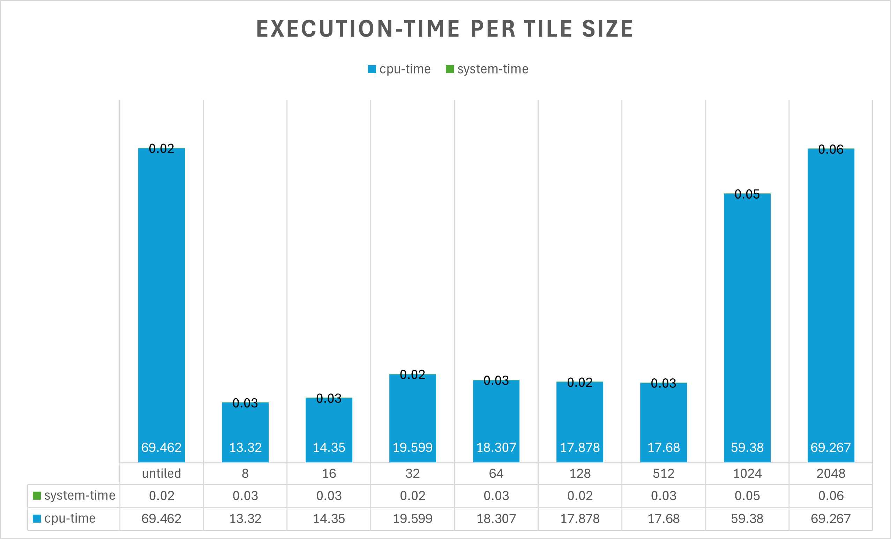
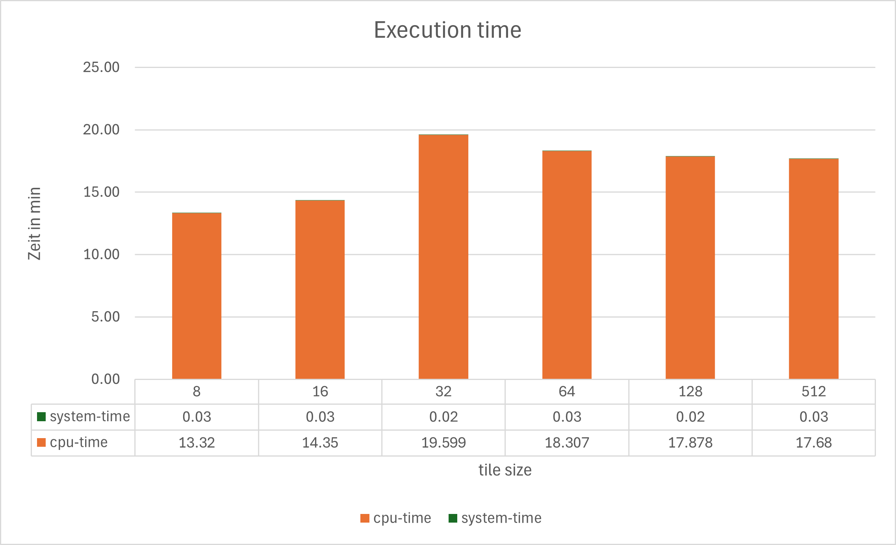

# Sheet 06

## Exercise 01

After applying loop tiling, the execution time decreased significantly. We tiled all three loops, to ensure benefits in cache utilization for both the input and output matrices.  
Looking at the charts one can see that a tile size between 8 and 512 is ideal, with 8 being the best choice closely followed by 16, leading me to believe that the cache line size on lcc3 is something along those 8 / 16 MB.  
Interestingly, 32 is the worst of the aformentioned, with 64 - 512 being over a second faster than size 32.  
1024 and 2084 perform really poorly, this makes sense since with size 2048 we reach the size of the matrices, at this point the tiled algorithm will work exactly like the untiled one, which one can see in the almost identical executiuon times of the 2.

|||
|--|--|
|||

