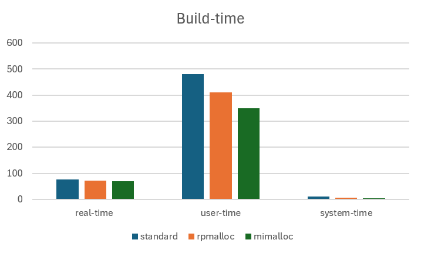
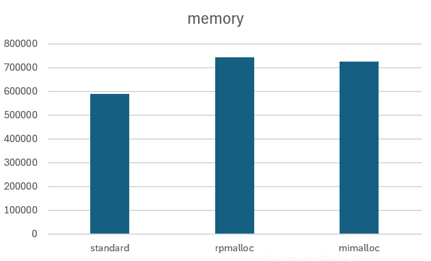

# Exercise sheet 07

### A)  Preloading General Allocators

__Preparation:__  
* Install & build rpmalloc and mimalloc  
* load correct clang version  
* prepare allscale_ap  
   

__Benchmarking:__  
* benchmark with no preloaded allocator  
* benchmark with mimalloc: env LD_PRELOAD=<absolute_path_to_mimalloc> /bin/time ninja)>)   
* benchmark with rpmalloc: env LD_PRELOAD=<absolute_path_to_rpmalloc> /bin/time ninja)>)

</break>

__Results:__

 

As we can see, both allocators are faster than the standard allocator when it comes to building the project. Although they need more memory when building the project. Mimalloc is not just faster than rpmalloc it also needs a little bit less memory and therefore is in this case the more efficient option.