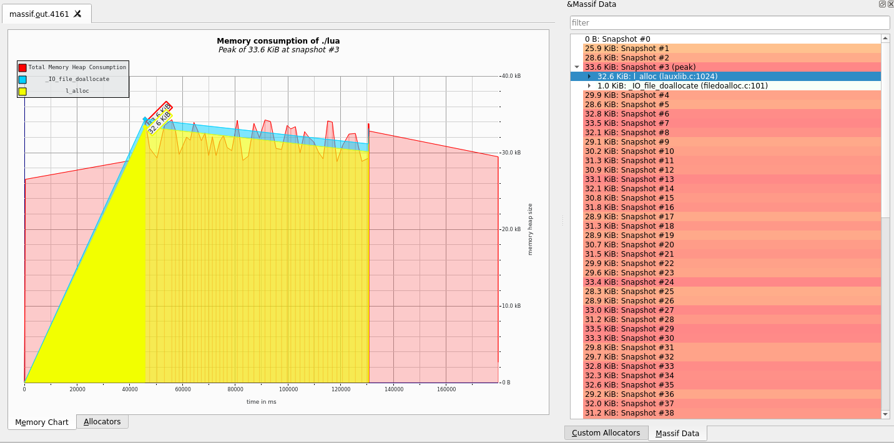
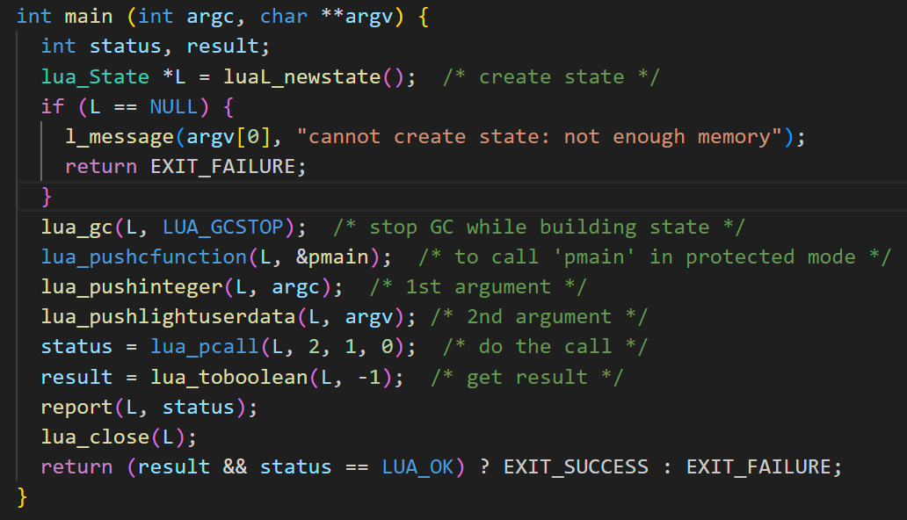

Exercise Sheet 12 (final)
=========================

This exercise sheet about the Lua interpreter should be worked on **in groups**.  
Perform all benchmarks on LCC3.


A) Setup and Basic Execution
----------------------------

Get the latest stable baseline Lua interpreter sources here: https://www.lua.org/download.html
Compile it, and use it to run the benchmarks in `lua/fib.lua` ["the benchmark"], i.e:

```
lua perf-oriented-dev/lua/fib.lua
```

Note the timing results you get for these initial runs, we will use them as our baseline.

----------------------------
----------------------------

To get and build lua, you just have to execute the following steps:

```
curl -L -R -O https://www.lua.org/ftp/lua-5.4.6.tar.gz
tar zxf lua-5.4.6.tar.gz
cd lua-5.4.6
make all test
```

Then you can execute the built lua-interpreter along with a given lua file, in our case fib.lua to run it.

The initial output on a laptop was:
```
100 x fibonacci_naive(30)     time:   5.9065 s  --  832040
10000000 x fibonacci_tail(30) time:   7.9226 s  --  832040
25000000 x fibonacci_iter(30) time:  10.1237 s  --  832040
```

On LCC3 we got the following times (5 executions and mean):
```
100 x fibonacci_naive(30)     time:  12.3040 s  --  832040
10000000 x fibonacci_tail(30) time:  12.6248 s  --  832040
25000000 x fibonacci_iter(30) time:  10.8662 s  --  832040

100 x fibonacci_naive(30)     time:  13.0221 s  --  832040
10000000 x fibonacci_tail(30) time:  12.5408 s  --  832040
25000000 x fibonacci_iter(30) time:  11.3255 s  --  832040

100 x fibonacci_naive(30)     time:  12.3486 s  --  832040
10000000 x fibonacci_tail(30) time:  12.6216 s  --  832040
25000000 x fibonacci_iter(30) time:  10.9235 s  --  832040

100 x fibonacci_naive(30)     time:  12.3545 s  --  832040
10000000 x fibonacci_tail(30) time:  12.6437 s  --  832040
25000000 x fibonacci_iter(30) time:  10.9221 s  --  832040

100 x fibonacci_naive(30)     time:  12.2880 s  --  832040
10000000 x fibonacci_tail(30) time:  12.5890 s  --  832040
25000000 x fibonacci_iter(30) time:  10.8279 s  --  832040

Mean:
100 x fibonacci_naive(30)     time:  12.46344
10000000 x fibonacci_tail(30) time:  12.60398
25000000 x fibonacci_iter(30) time:  10.97304
```

The calculated mean will be our baseline for the optimization later.


B) Profiling
------------

 * Apply a profiler of your choice to study the behaviour of the Lua interpreter while running the benchmark.
 * Is the result sufficient to base optimization decisions on? Why? If not, use other tools or manually track and report additional information about the execution.

Report and discuss your results.

----------------------------
----------------------------


At first, we profiled the execution of the Lua interpreter with the fib.lua file using the gprof profiler. To make this work, we had to add the **-pg** flag to the following lines in the Makefile of the Lua interpreter:

```
CFLAGS= -pg -O2 -Wall -Wextra -DLUA_COMPAT_5_3 $(SYSCFLAGS) $(MYCFLAGS)
LDFLAGS= -pg $(SYSLDFLAGS) $(MYLDFLAGS)
```

After again executing the fib.lua file and receiving the gmon.out file, to obtain the analysis.txt file, we executed:

```
gprof ./lua gmon.out > analysis.txt
```

The results on a laptop were the following:

```
Flat profile:

Each sample counts as 0.01 seconds.
  %   cumulative   self              self     total           
 time   seconds   seconds    calls   s/call   s/call  name    
 87.14     18.83    18.83        1    18.83    20.72  luaV_execute
  5.04     19.92     1.09 310000031    0.00     0.00  luaD_pretailcall
  4.07     20.80     0.88 306946270    0.00     0.00  luaD_precall
  1.90     21.21     0.41 271946189    0.00     0.00  luaH_getshortstr
  0.37     21.29     0.08 20000290     0.00     0.00  freeobj
  0.32     21.36     0.07 35000103     0.00     0.00  luaT_getvarargs
  0.19     21.40     0.04   714299     0.00     0.00  dothecall
  0.14     21.43     0.03 40000948     0.00     0.00  l_alloc
  0.14     21.46     0.03 25000004     0.00     0.00  luaV_tointeger
  0.14     21.49     0.03 20000364     0.00     0.00  luaM_malloc_
  0.14     21.52     0.03 20000290     0.00     0.00  luaC_newobj
  0.14     21.55     0.03 10000006     0.00     0.00  luaF_newLclosure
  0.09     21.57     0.02 20000430     0.00     0.00  luaM_free_
  0.09     21.59     0.02 10000001     0.00     0.00  luaF_findupval
  0.05     21.60     0.01   142860     0.00     0.00  luaS_clearcache
  0.05     21.61     0.01                             _init
  0.00     21.61     0.00 10000002     0.00     0.00  luaF_closeupval
  0.00     21.61     0.00   571440     0.00     0.00  clearbyvalues
  0.00     21.61     0.00   571440     0.00     0.00  correctgraylist
  0.00     21.61     0.00   286012     0.00     0.00  reallymarkobject
  0.00     21.61     0.00   285781     0.00     0.00  propagatemark
  0.00     21.61     0.00   285720     0.00     0.00  clearbykeys
  0.00     21.61     0.00   285720     0.00     0.00  convergeephemerons
  0.00     21.61     0.00   142868     0.00     0.00  luaE_setdebt
  0.00     21.61     0.00   142866     0.00     0.00  luaC_step
  0.00     21.61     0.00   142861     0.00     0.00  separatetobefnz
  0.00     21.61     0.00   142860     0.00     0.00  atomic
  0.00     21.61     0.00   142860     0.00     0.00  finishgencycle
  0.00     21.61     0.00      676     0.00     0.00  save
```

For more details, including the call graph, see analysis.txt

So this is probably not sufficient to perform optimizations, we might still need to have a look at other aspects that can impact performance, but it is a good starting point to look for optimization opportunities in the parts of the interpreter that take the most amount of execution time. Now we also have to keep in mind that we want not the overall time spent in the interpreter to be the shortest, but rather that the time spent in the three benchmark functions inside the fib.lua file to be optimized. The fact, that the most of the time is spent inside **luaV_execute**, where then our fib.lua gets executed doesn't help that much, since we need a more detailed view of where the bottlenecks inside that function are located at.

--- 
To also cover having a look at the memory consumption, we as well decided to use massif along with the massif-visualizer tool.

To obtain the massiv.out file, we needed to compile the lua interpreter with the **-g** flag. To make profiling more accurate, we set the optimizations to **O0**.

```
CFLAGS= -g -O0 -Wall -Wextra -DLUA_COMPAT_5_3 $(SYSCFLAGS) $(MYCFLAGS)
```

We got the following results from the massif visualizer



What we can see here is that the largest allocations happen in the **l_alloc** function with 32.6 KiB. The allocated memory changes frequently with jumps of about 4KB. The **l_alloc** function is also listed in our gprof output, but with only 0.03 seconds of overall execution time, we think we cannot consider starting to optimize that function for our exercise D, but overall when optimizing the interpreter, we might as well should have a look at the allocation patterns and check if the interpreter would profit from using a different general purpose memory allocator.

---
Since recursion might impact the accuracy of branch prediction, we did a quick profile with perf stat, which showed the following:

```
 Performance counter stats for './lua-5.4.6/src/lua fib.lua':

         11.808,02 msec task-clock:u                     #    1,000 CPUs utilized             
                 0      context-switches:u               #    0,000 /sec                      
                 0      cpu-migrations:u                 #    0,000 /sec                      
                90      page-faults:u                    #    7,622 /sec                      
    37.499.158.256      cpu_atom/cycles/u                #    3,176 GHz                         (0,17%)
    56.860.097.114      cpu_core/cycles/u                #    4,815 GHz                         (99,83%)
   150.269.814.670      cpu_atom/instructions/u          #    4,01  insn per cycle              (0,17%)
   268.508.862.854      cpu_core/instructions/u          #    7,16  insn per cycle              (99,83%)
    19.793.920.348      cpu_atom/branches/u              #    1,676 G/sec                       (0,17%)
    38.815.226.176      cpu_core/branches/u              #    3,287 G/sec                       (99,83%)
        40.625.881      cpu_atom/branch-misses/u         #    0,21% of all branches             (0,17%)
        62.779.871      cpu_core/branch-misses/u         #    0,32% of all branches             (99,83%)
             TopdownL1 (cpu_core)                 #     10,3 %  tma_backend_bound      
                                                  #      3,6 %  tma_bad_speculation    
                                                  #     13,2 %  tma_frontend_bound     
                                                  #     72,9 %  tma_retiring             (99,83%)
             TopdownL1 (cpu_atom)                 #      2,8 %  tma_bad_speculation    
                                                  #     80,4 %  tma_retiring             (0,17%)
                                                  #      0,1 %  tma_backend_bound      
                                                  #      0,1 %  tma_backend_bound_aux  
                                                  #     16,7 %  tma_frontend_bound       (0,17%)
```

As one can see, branch misses are at around 0.3%, so this should not have that big of an impact on performance. 

C) Code Understanding
---------------------

 * Describe the overall process of Lua execution in the interpreter. What are the major phases, and how much time do they take for the benchmark?
 * What does the option `LUA_USE_JUMPTABLE` do? Measure its performance impact on the benchmark.


----------------------------
----------------------------

The major phases include initialization, parsing and call preparation, execution and cleanup of the Lua code.





#### 1. Initialization  
As we can see from the screenshot the first step is to create a new state before loading or parsing the functions

#### 2. Parsing / Call preparation  
In the second phase everything gets set up for the file/function to be executed. In this phase the Garbage Collector is stopped and the program arguments are passed on to the functions. Furthermore the function pmain parses the used function itself with the call dofile.

#### 3. Execution  
With the function lua_pcall the actuall function is then executed.

#### 4. Cleanup  
After the function call the result of the function is handeled and reported. In the end the Lua State is closed.

The option LUA_USE_JUMPTABLE in Lua is a compilation flag that enables the use of a jump table for executing bytecode instructions. This can improve the performance of the Lua interpreter by optimizing the dispatch mechanism for bytecode execution.

Understanding Bytecode Dispatch Mechanisms:
When the Lua virtual machine (VM) **see lvm.c** executes bytecode instructions, it needs to determine which operation to perform for each bytecode. The way the VM dispatches these instructions can significantly affect performance. There are typically two main dispatch mechanisms:

1. Switch-Case Dispatch:   
This is the default method used by many interpreters. The VM uses a switch statement (or a series of if-else statements) to select the appropriate action based on the current bytecode instruction.

2. Direct Threading (Jump Table):   
This method uses a table of function pointers (or labels in GCC) to directly jump to the code handling the specific bytecode instruction. This can be more efficient than a switch statement because it avoids the need for multiple comparisons and branches.

#### Enabling LUA_USE_JUMPTABLE  
When LUA_USE_JUMPTABLE is defined, the Lua interpreter uses the jump table mechanism instead of the switch-case mechanism for bytecode execution. This can result in faster bytecode dispatch, reducing the overhead of interpreting instructions and thus improving overall performance. ljumptab.h gets included in luaV_execute.

#### How to Enable LUA_USE_JUMPTABLE  
If not already set, it is enabled by default if you use a GNU compiler. You can set the macro either by passing it as a preprocessor directive directly to the compiler or modify the following lines of the lvm.c file to your needs (just using one of the two #define lines and removing everything else):

```
#if !defined(LUA_USE_JUMPTABLE)
#if defined(__GNUC__)
#define LUA_USE_JUMPTABLE 1
#else
#define LUA_USE_JUMPTABLE 0
#endif
#endif
```

However, we thought it would make more of an impact to set or unset this option, but it turns out, that for our program it depends on the function. Some are faster, while some are slower, but there is not much of a difference:

LUA_USE_JUMPTABLE 1:

```
100 x fibonacci_naive(30)     time:  13.0088 s  --  832040
10000000 x fibonacci_tail(30) time:  12.6484 s  --  832040
25000000 x fibonacci_iter(30) time:  10.9184 s  --  832040
```

LUA_USE_JUMPTABLE 0:

```
100 x fibonacci_naive(30)     time:  12.9463 s  --  832040
10000000 x fibonacci_tail(30) time:  12.7264 s  --  832040
25000000 x fibonacci_iter(30) time:  11.7258 s  --  832040
```


D) Optimization
---------------

Optimize the Lua interpreter to more efficiently execute the benchmark.  
Valid strategies include:

 * Compiler optimizations or hints
 * Any manual procedural or algorithmic optimizations
 * Making suitable assumptions / implementing heuristics based on the properties of the benchmark

**Invalid** strategies are:

 * Anything which checks the source code (or its hash etc) against a table of pre-built or pre-optimized solutions
 * Anything which touches the input program
 * Obviously, anything which breaks the interpreter for any other valid Lua program

Your tuned interpreters' best times for all 3 benchmarks will be compared against all other groups' times.

----------------------------
----------------------------

What we tried so far:

- various different kinds of flags and compiler optimizations
- using mimalloc
- simplify the build process and combine everything from the lua interpreter in one single file to benefit from better compiler optimizations 
- move the positions of the cases in the large switch statements that handles the OPCODES around
- try to move different OPCODES that are most frequently used according to a paper (like OP_ADD) in front of the switch statement into an if statement
- tweaked various constants like 
	- LUAI_GCPAUSE (affects frequency of gc)
	- LUAI_GCMUL (affects aggressiveness of gc)

none of the above led to noticable performance improvements that go beyond the inconsistencies of the measurements.


Submission
----------
Please submit your solutions by email to peter.thoman at UIBK, using the string "[Perf2024-sheet12]" in the subject line, before the start of the next VU at the latest.
Include your group composition in the email.  
Try not to include attachments with a total size larger than 2 MiB.