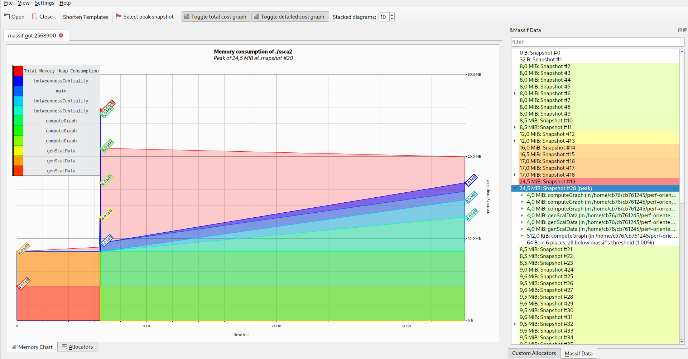

# Exercise Sheet 4

## Exercise 1 - SSCA

ssca profiled on lcc3 with scale 17, buildtype release

### Massif output

### Time 

### Conclusion

## Exercise 1 - NPB_BT
npb_bt_a profiled on lcc3

### Massif Output

### Time
| | With valgrind | without valgrind |
|--|--|--|
|real | 11m8.174s | 1m10.953s |
|user | 11m5.783s | 1m10.726s |
|sys | 0m0.121s | 0m0.007s |

## Exercise 2

