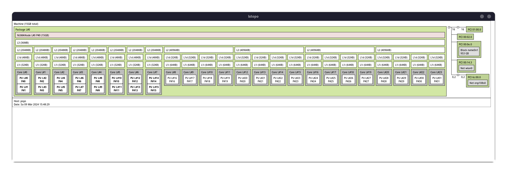
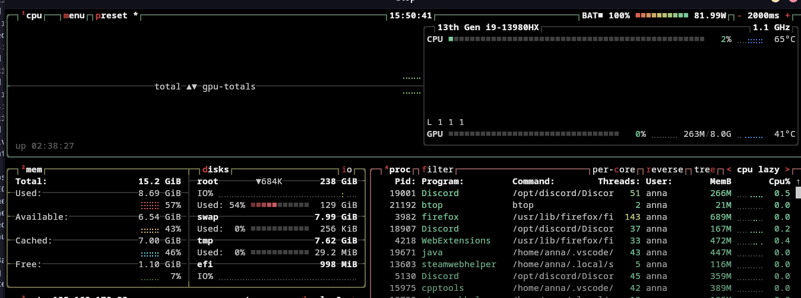

# Sheet 1

| program | parameters | wall clock time | CPU time | system time | max memory usage |
|--|--|--|--|--|--|
| filegen | 15 15 1024000 1048576 | 02.32s | 02.24s | 0.07s | 2100kB |
| filesearch | / (previously generated 5000 files) | 00.01s | 0.00s | 0.01s | 1280kB |
| mmul | / | 0.56s | 0.56s | 0.00 | 24320kB |
| nbody | / | 0.35s | 0.34s | 0.00s | 1536kB |
| qap | problems/chr15a.dat | 01.24s | 01.24s | 0.00s | 1260kB |
| delannoy | 14 | 01.85s | 01.85s | 0.00s | 1024 |

## mean and variance for 10 repetitions
delannoy:
Mean: {'wall_clock_time:': 0.16333333333333333, 'CPU_time:': 0.16333333333333333, 'system_time:': 0.0, 'max_memory_usage:': 1024.0}
Variance: {'wall_clock_time:': 0.000433333333333333, 'CPU_time:': 0.000433333333333333, 'system_time:': 0.0, 'max_memory_usage:': 0.0}

filegen:
Mean: {'wall_clock_time:': 2.3933333333333335, 'CPU_time:': 2.34, 'system_time:': 0.04666666666666667, 'max_memory_usage:': 2101.3333333333335}
Variance: {'wall_clock_time:': 0.005633333333333324, 'CPU_time:': 0.0061000000000000195, 'system_time:': 0.00013333333333333329, 'max_memory_usage:': 77541.33333333333}

filesearch:
Mean: {'wall_clock_time:': 0.0, 'CPU_time:': 0.0, 'system_time:': 0.0, 'max_memory_usage:': 1280.0}
Variance: {'wall_clock_time:': 0.0, 'CPU_time:': 0.0, 'system_time:': 0.0, 'max_memory_usage:': 0.0}

mmul:
Mean: {'wall_clock_time:': 0.5666666666666667, 'CPU_time:': 0.5566666666666666, 'system_time:': 0.0, 'max_memory_usage:': 24486.666666666668}
Variance: {'wall_clock_time:': 0.005033333333333334, 'CPU_time:': 0.005033333333333334, 'system_time:': 0.0, 'max_memory_usage:': 72069.33333333333}

nbody:
Mean: {'wall_clock_time:': 0.37333333333333335, 'CPU_time:': 0.37, 'system_time:': 0.0, 'max_memory_usage:': 1536.0}
Variance: {'wall_clock_time:': 0.000833333333333333, 'CPU_time:': 0.0006999999999999996, 'system_time:': 0.0, 'max_memory_usage:': 0.0}

qap:
Mean: {'signal': 11.0, 'wall_clock_time:': 0.12333333333333334, 'CPU_time:': 0.0, 'system_time:': 0.0, 'max_memory_usage:': 1194.6666666666667}
Variance: {'signal': 0.0, 'wall_clock_time:': 0.0009333333333333333, 'CPU_time:': 0.0, 'system_time:': 0.0, 'max_memory_usage:': 21845.333333333332}

## Architecture:

