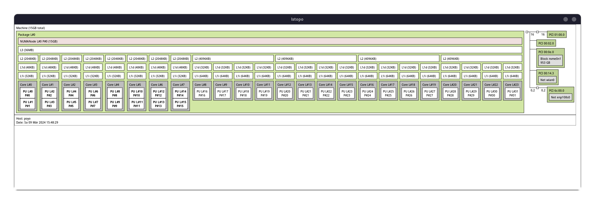
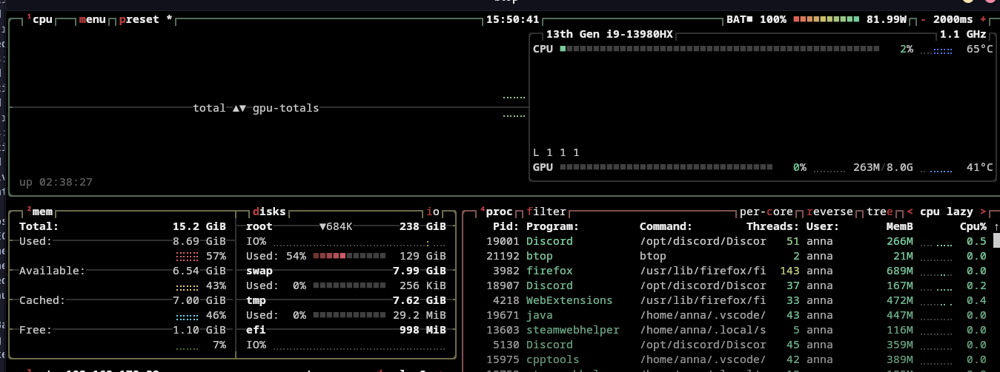

# Sheet 1

## Metrics locally

| program    | parameters                     | wall clock time | CPU time | system time | max memory usage |
|------------|--------------------------------|-----------------|----------|-------------|------------------|
| filegen    | 15 15 1024000 1048576          | 02.32s          | 02.24s   | 0.07s       | 2100kB           |
| filesearch | / (previously generated files) | 00.01s          | 0.00s    | 0.01s       | 1280kB           |
| mmul       | /                              | 0.56s           | 0.56s    | 0.00        | 24320kB          |
| nbody      | /                              | 0.35s           | 0.34s    | 0.00s       | 1536kB           |
| qap        | problems/chr15a.dat            | 01.24s          | 01.24s   | 0.00s       | 1260kB           |
| delannoy   | 14                             | 0.23s           | 0.23s    | 0.00s       | 1024kB           |

### Mean & Variance
| Task           | Wall Clock Time |                        | CPU Time |                        | System Time |                        | Max Memory Usage |              |
|----------------|-----------------|------------------------|----------|------------------------|-------------|------------------------|------------------|--------------|
|                | **Mean**        | **Variance**           | **Mean** | **Variance**           | **Mean**    | **Variance**           | **Mean**         | **Variance** |
| **Delannoy**   | 0.636           | 0.0006300000000000011  | 0.622    | 2.000000000000004e-05  | 0.0         | 0.0                    | 1389.6           | 676.8        |
| **Filegen**    | 5.934           | 0.01512999999999998    | 3.06     | 0.00020000000000000258 | 0.2         | 4.999999999999995e-05  | 2468.8           | 2483.2       |
| **Filesearch** | 0.002           | 1.9999999999999998e-05 | 0.0      | 0.0                    | 0.0         | 0.0                    | 1432.0           | 8624.0       |
| **MMUL**       | 7.118           | 8.153870000000001      | 7.084    | 8.07743                | 0.008       | 1.9999999999999998e-05 | 24492.8          | 4859.2       |
| **Nbody**      | 2.56            | 0.0                    | 2.55     | 0.0                    | 0.0         | 0.0                    | 1828.0           | 1512.0       |
| **QAP**        | 3.5             | 0.00019999999999999592 | 3.494    | 0.00028000000000000003 | 0.0         | 0.0                    | 1488.0           | 1384.0       |

## Metrics on LCC3
| program    | parameters                     | wall clock time | CPU time | system time | max memory usage |
|------------|--------------------------------|-----------------|----------|-------------|------------------|
| filegen    | 15 15 1024000 1048576          | 06.27s          | 03.08s   | 0.22s       | 2516kB           |
| filesearch | / (previously generated files) | 0.01s           | 0.00s    | 0.01s       | 1556kB           |
| mmul       | /                              | 1.99s           | 1.98s    | 0.00        | 24656kB          |
| nbody      | /                              | 2.55s           | 2.54s    | 0.00s       | 1804kB           |
| qap        | problems/chr15a.dat            | 03.48s          | 03.47    | 0.00s       | 1260kB           |
| delannoy   | 12                             | 0.63            | 0.62     | 0.00s       | 1368kB           |

### Mean & Variance
| Task           | Wall Clock Time |              | CPU Time |              | System Time |              | Max Memory Usage |              |
|----------------|-----------------|--------------|----------|--------------|-------------|--------------|------------------|--------------|
|                | **Mean**        | **Variance** | **Mean** | **Variance** | **Mean**    | **Variance** | **Mean**         | **Variance** |
| **Delannoy**   | 0.636           | 0.00063      | 0.622    | 0.00002      | 0.0         | 0.0          | 1389.6           | 676.8        |
| **Filegen**    | 5.934           | 0.01513      | 3.06     | 0.0002       | 0.2         | 0.00005      | 2468.8           | 2483.2       |
| **Filesearch** | 0.002           | 0.00002      | 0.0      | 0.0          | 0.0         | 0.0          | 1432.0           | 8624.0       |
| **MMUL**       | 7.118           | 8.15387      | 7.084    | 8.07743      | 0.008       | 0.00002      | 24492.8          | 4859.2       |
| **Nbody**      | 2.56            | 0.0          | 2.55     | 0.0          | 0.0         | 0.0          | 1828.0           | 1512.0       |
| **QAP**        | 3.5             | 0.0002       | 3.494    | 0.00028      | 0.0         | 0.0          | 1488.0           | 1384.0       |

## Local Architecture:

## Script 
The script outputs mean and variance for each program (see below), and stores the output of each program call as well as the accumulated variance / mean of all of them in a log file called raw_data.json  (logfiles for measurements both local and on lcc3 can be found in the submission folder)  
Usage: place the pyhton file in the build directory and execute with the desired number of iterations as a commandline argument

## outputs (variance & mean)
### local
Examining 5 interation(s) per program

***delannoy***:  
Mean: {'wall_clock_time:': 0.16333333333333333, 'CPU_time:': 0.16333333333333333, 'system_time:': 0.0, 'max_memory_usage:': 1024.0}
Variance: {'wall_clock_time:': 0.000433333333333333, 'CPU_time:': 0.000433333333333333, 'system_time:': 0.0, 'max_memory_usage:': 0.0}

***filegen***:  
Mean: {'wall_clock_time:': 2.3933333333333335, 'CPU_time:': 2.34, 'system_time:': 0.04666666666666667, 'max_memory_usage:': 2101.3333333333335}
Variance: {'wall_clock_time:': 0.005633333333333324, 'CPU_time:': 0.0061000000000000195, 'system_time:': 0.00013333333333333329, 'max_memory_usage:': 77541.33333333333}

***filesearch***:  
Mean: {'wall_clock_time:': 0.0, 'CPU_time:': 0.0, 'system_time:': 0.0, 'max_memory_usage:': 1280.0}
Variance: {'wall_clock_time:': 0.0, 'CPU_time:': 0.0, 'system_time:': 0.0, 'max_memory_usage:': 0.0}

***mmul***:  
Mean: {'wall_clock_time:': 0.5666666666666667, 'CPU_time:': 0.5566666666666666, 'system_time:': 0.0, 'max_memory_usage:': 24486.666666666668}
Variance: {'wall_clock_time:': 0.005033333333333334, 'CPU_time:': 0.005033333333333334, 'system_time:': 0.0, 'max_memory_usage:': 72069.33333333333}

***nbody***:  
Mean: {'wall_clock_time:': 0.37333333333333335, 'CPU_time:': 0.37, 'system_time:': 0.0, 'max_memory_usage:': 1536.0}
Variance: {'wall_clock_time:': 0.000833333333333333, 'CPU_time:': 0.0006999999999999996, 'system_time:': 0.0, 'max_memory_usage:': 0.0}

***qap***:  
Mean: {'signal': 11.0, 'wall_clock_time:': 0.12333333333333334, 'CPU_time:': 0.0, 'system_time:': 0.0, 'max_memory_usage:': 1194.6666666666667}
Variance: {'signal': 0.0, 'wall_clock_time:': 0.0009333333333333333, 'CPU_time:': 0.0, 'system_time:': 0.0, 'max_memory_usage:': 21845.333333333332}

### LCC3
Examining 5 interation(s) per program

**delannoy:**  
Mean: {'wall_clock_time:': 0.636, 'CPU_time:': 0.622, 'system_time:': 0.0, 'max_memory_usage:': 1389.6}
Variance: {'wall_clock_time:': 0.0006300000000000011, 'CPU_time:': 2.000000000000004e-05, 'system_time:': 0.0, 'max_memory_usage:': 676.8}

**filegen:**    
Mean: {'wall_clock_time:': 5.934, 'CPU_time:': 3.06, 'system_time:': 0.2, 'max_memory_usage:': 2468.8}
Variance: {'wall_clock_time:': 0.01512999999999998, 'CPU_time:': 0.00020000000000000258, 'system_time:': 4.999999999999995e-05, 'max_memory_usage:': 2483.2}

**filesearch:**  
Mean: {'wall_clock_time:': 0.002, 'CPU_time:': 0.0, 'system_time:': 0.0, 'max_memory_usage:': 1432.0}
Variance: {'wall_clock_time:': 1.9999999999999998e-05, 'CPU_time:': 0.0, 'system_time:': 0.0, 'max_memory_usage:': 8624.0}

**mmul:**  
Mean: {'wall_clock_time:': 7.118, 'CPU_time:': 7.084, 'system_time:': 0.008, 'max_memory_usage:': 24492.8}
Variance: {'wall_clock_time:': 8.153870000000001, 'CPU_time:': 8.07743, 'system_time:': 1.9999999999999998e-05, 'max_memory_usage:': 4859.2}

**nbody:**  
Mean: {'wall_clock_time:': 2.56, 'CPU_time:': 2.55, 'system_time:': 0.0, 'max_memory_usage:': 1828.0}
Variance: {'wall_clock_time:': 0.0, 'CPU_time:': 0.0, 'system_time:': 0.0, 'max_memory_usage:': 1512.0}

**qap:**  
Mean: {'wall_clock_time:': 3.5, 'CPU_time:': 3.494, 'system_time:': 0.0, 'max_memory_usage:': 1488.0}
Variance: {'wall_clock_time:': 0.00019999999999999592, 'CPU_time:': 0.00028000000000000003, 'system_time:': 0.0, 'max_memory_usage:': 1384.0}

